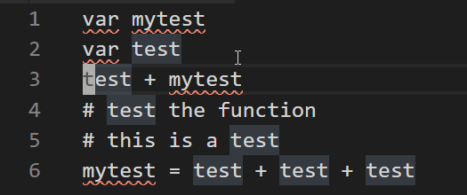

# multi-occur README

This extension allows the creation of multiple-cursor at selected occurences of a target string.
The search for occurences can be limited to specific (also non contiguous) regions in the text and occurences can be cycled through and toggled before creating cursors on them

The extension is still in alpha stage.

Keybindings are set assuming the presence of vscode Vim

## Features

Here is an example of the main capabilities of the extension

## Release Notes

### 0.0.2

Initial Release
-----------------------------------------------------------------------------------------------------------